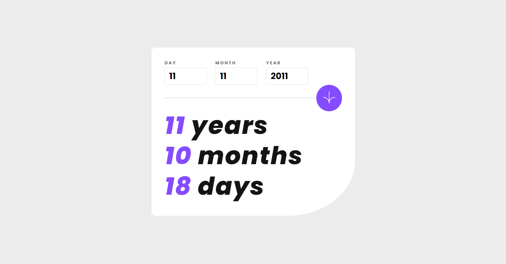

# Age calculator

## Table of contents

- [Overview](#overview)
  - [The challenge](#the-challenge)
  - [Screenshot](#screenshot)
  - [Links](#links)
- [Built with](#built-with)

## Overview

### The challenge

Users should be able to:

- View an age in years, months, and days after submitting a valid date through the form
- Receive validation errors if:
  - Any field is empty when the form is submitted
  - The day number is not between 1-31
  - The month number is not between 1-12
  - The year is in the future
- **Bonus**: See the age numbers animate to their final number when the form is submitted (done)

### Screenshot

### Links

- Live Site URL: [Add live site URL here](https://your-live-site-url.com)

## Built with

- [React](https://reactjs.org/)
- [Typescript](https://www.typescriptlang.org/)
- [Day.js](https://day.js.org/)
- [React-hook-form](https://react-hook-form.com/)
- [Framer-motion](https://www.framer.com/motion/)
